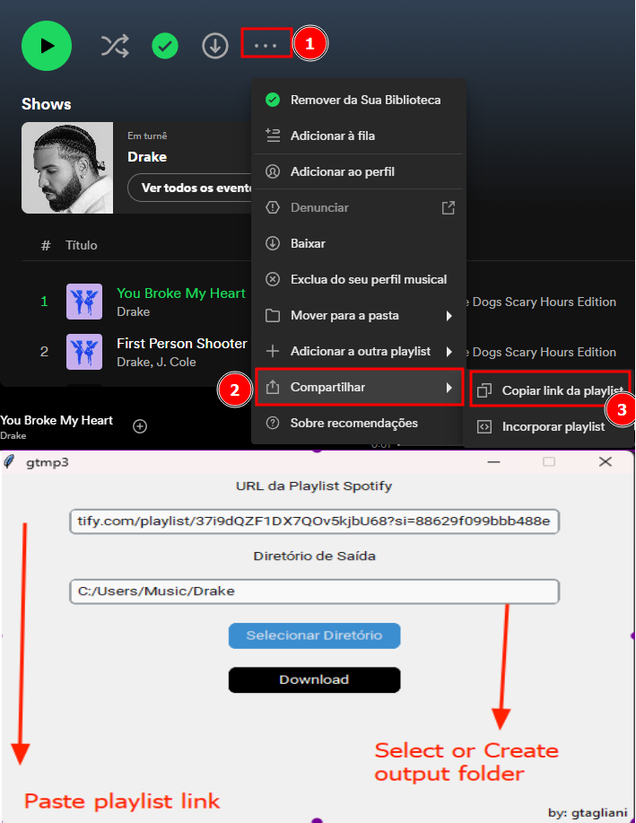

# How to Use
This document guides you on how to use the Spotify playlist downloader. \
Follow these steps to download your favorite Spotify playlists.

# Prerequisites

* Spotify Playlist URL:
    - Ensure that the URL is for a Spotify playlist. The tool does not support album or show URLs.
    - Example: https://open.spotify.com/playlist/37i9dQZF1DX7QOv5kjbU68?si=167db35e69a04e3d
* Output Location:
    - Specify the location where your playlist music will be saved.
    - You can create a new folder using the interactive Windows file explorer.

# Setting up Developer Mode
- Visit the Spotify Developer website.
- Obtain your credentials (Client ID and Client Secret).
- Create a .env file in the root directory of your project.
- Store your Spotify credentials in this file

# Example:

